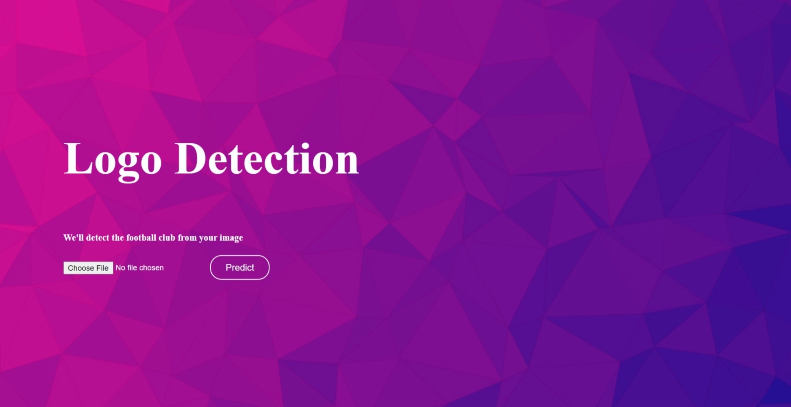

# [EPL Logo Detection](https://epl-logo-detection.herokuapp.com/)

An image classification app that detects the Football Club from an image containing an English Premier League Club logo in it. This project was borne out of my passion for football but I’m more into La Liga which is a Spanish league but I couldn’t find a dataset for it. This project helped me get familiar with the English league which is more entertaining, I’ve heard.

## [Dataset](https://www.kaggle.com/alexteboul/english-premier-league-logo-detection-20k-images)

- I snatched the dataset from Kaggle as peeps often do
- The raw dataset came in a single directory which was not ideal for training and validation purposes
- This required some data reorganization which was achieved through a utility function, it split the data into training, validation, test and made life easier

## [Model Training](https://github.com/Jobin-Nelson/EPL_logo_detection-project/blob/main/dl/playground.ipynb)

- Created data generators for easy loading of data for training with the help of TensorFlow
- Build a Convolutional neural network to extract features and classify the image
- Experimented with different models and saved the one which yielded the best result using checkpoint callbacks in Tensorflow
- The dataset was fairly easy to train and classify which didn’t require transfer learning
- Saved the best performing model for prediction on input images

## [Web App](https://epl-logo-detection.herokuapp.com/)

- Created an HTTP server with python Flask using HTML and CSS,
- Integrated the model as backed to process the input image and detect the Club
- Deployed the app on the Heroku platform by connecting to the Heroku branch of this repo
- You can view the app [here](https://epl-logo-detection.herokuapp.com/)

*Tools: Tensorflow, Flask, scikit-learn*